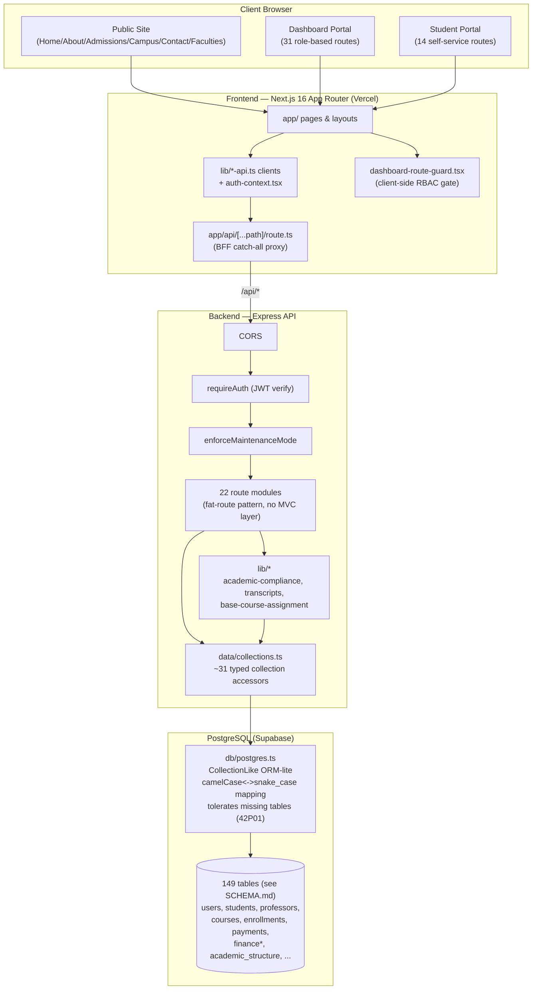
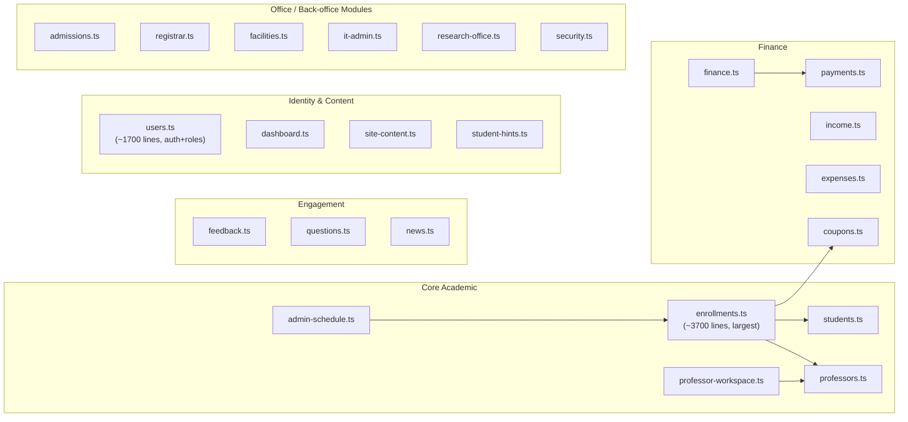
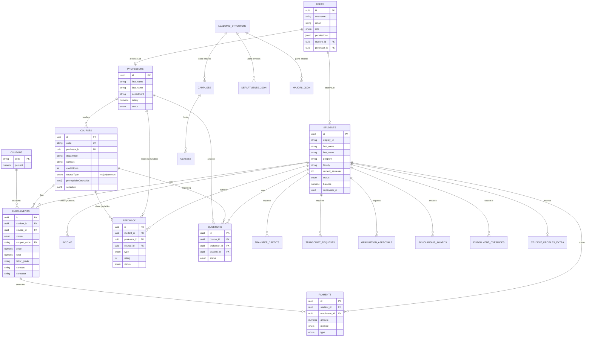
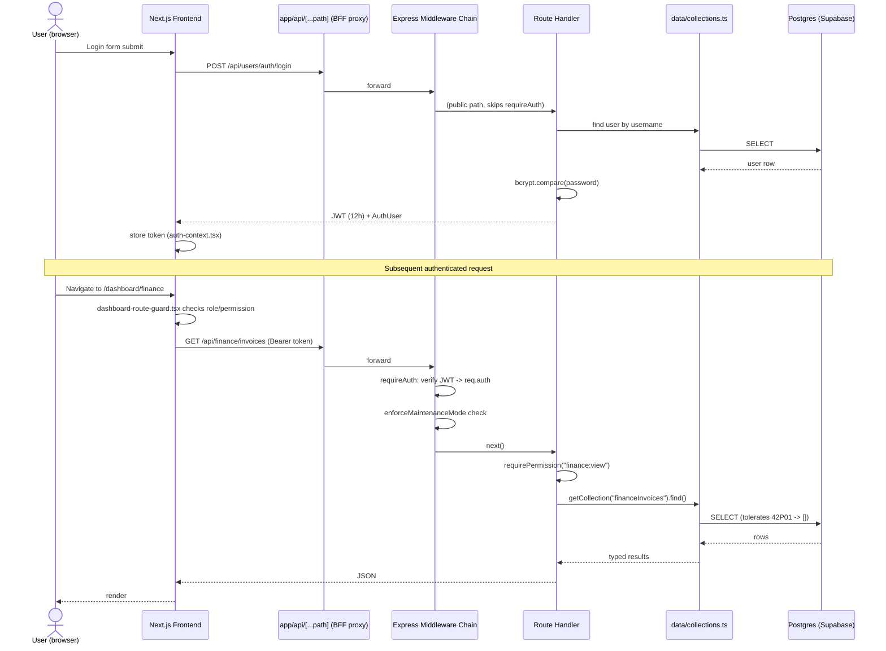
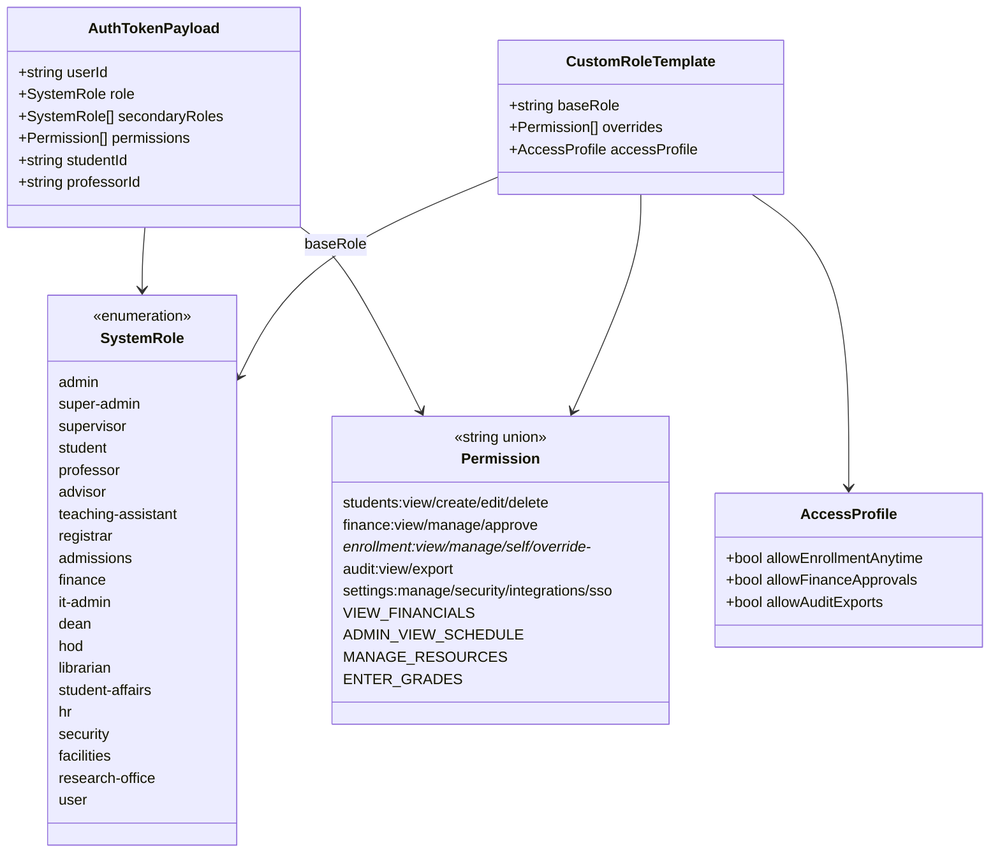
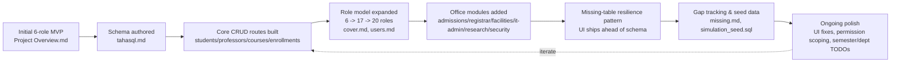

# UNYT System — Architecture & UML

System: university admin + student portal (University of New York Tirana). Monorepo, no build orchestrator (npm + concurrently). Dev model: not classic waterfall — evolved **incrementally/agile**, feature-by-feature, roles grew 6→20 over time, schema patched live via ad-hoc SQL + resilience-to-missing-tables pattern. See "Dev Model" section at bottom.

> **Schema drift notice (2026-08-10):** this doc's ERD and table counts below are illustrative/core-only and are stale — they undercount the live database badly (~35 tables claimed vs **149 actual**, per live introspection). See [`SCHEMA.md`](./SCHEMA.md) for the full, generated, ground-truth table reference (columns, PKs, FKs, row estimates) covering HR/payroll, library, research, campus life, quizzes/attendance, security/IT, and reporting subsystems this doc never described. Treat `SCHEMA.md` as authoritative for schema; treat this file as authoritative for request flow, auth, and route architecture, which were verified against source and remain accurate.

---

## 1. Tech Stack

| Layer | Tech |
|---|---|
| Frontend | Next.js 16 (App Router), React 19, Tailwind CSS 4, Radix/shadcn UI, react-hook-form + zod, TanStack Query/Table, Recharts, Playwright (e2e) |
| Backend | Node.js + Express 4, TypeScript (ESM), tsx (dev) / tsc (prod build) |
| DB access | Raw `pg` driver wrapped in custom Mongo-like collection layer (`db/postgres.ts`) — no ORM, no Prisma |
| Database | PostgreSQL (Supabase-hosted) |
| Auth | JWT (`jsonwebtoken`) + bcryptjs, 12h expiry, role+permission matrix |
| Validation | zod |
| Shared contract | `shared/types/index.ts` — single source of DTO/domain types, imported by both sides |
| Testing | Jest + Supertest (backend), Playwright (frontend e2e) |
| Deploy | Vercel (frontend), backend deploy target unspecified in repo |

---

## 2. High-Level System Architecture

---

## 3. Backend Module / Route Map

---

## 4. Entity Relationship Diagram (Core Schema)

---

## 5. Auth / Request Lifecycle (Sequence)

---

## 6. Role / Permission Model (Class-ish Diagram)

---

## 7. Frontend Route Tree (Component/Deployment view)

```mermaid
flowchart TD
    ROOT["frontend/app/"] --> HOME["page.tsx (landing)"]
    ROOT --> LOGIN["login/"]
    ROOT --> APIRT["api/[...path]/route.ts (proxy)"]
    ROOT --> DASHROOT["dashboard/ (layout + 31 sub-routes)"]
    ROOT --> STUROOT["student/ (14 sub-routes)"]

    DASHROOT --> D1["super-admin, dean, hod"]
    DASHROOT --> D2["registrar, admissions, advisor"]
    DASHROOT --> D3["finance, hr, facilities"]
    DASHROOT --> D4["it-admin, security, research(-office)"]
    DASHROOT --> D5["professor, professors, ta"]
    DASHROOT --> D6["librarian, student-affairs"]
    DASHROOT --> D7["users, audit, report, requests"]
    DASHROOT --> D8["students, students/[studentId]"]
    DASHROOT --> D9["news, feedback, notifications, settings"]
    DASHROOT --> D10["enrollment, grades-requests, applications"]

    STUROOT --> S1["enroll, enrollment-renewal, schedule"]
    STUROOT --> S2["grades, transcript, attendance"]
    STUROOT --> S3["billing, payment-plan"]
    STUROOT --> S4["profile, settings, supervisor, support"]
    STUROOT --> S5["department-courses, document-request, message"]
```

---

## 8. Development Model

Not waterfall. Evidence from repo:
- No phased sign-off docs, no requirements-freeze artifacts.
- `cover.md` (role list) → `Project Overview.md` (6-role MVP) → `users.md`/`test.md` (17–20 role expansion) show **incremental widening of scope after initial build**.
- `db/postgres.ts` explicitly tolerates missing tables (Postgres error 42P01 → return `[]`) — a deliberate "ship UI before schema exists" pattern, i.e. **feature-flag-free incremental/agile delivery**, not upfront full design.
- `missing.md` + `last thing was working on.md` are running gap-lists, characteristic of **iterative/agile sprints**, not waterfall stage-gates.
- `test.md` marks completion **per role as a percentage** ("Student role done 40%") — incremental, not phase-based.

**Closest label: Agile / incremental, feature-branch-by-role, schema-evolves-with-code.** If asked to draw a "waterfall" diagram for a slide anyway, still usable for presentation purposes (Requirements → Design → Implementation → Testing → Deployment → Maintenance) but it would not reflect actual project history — flag this to stakeholders if used.

